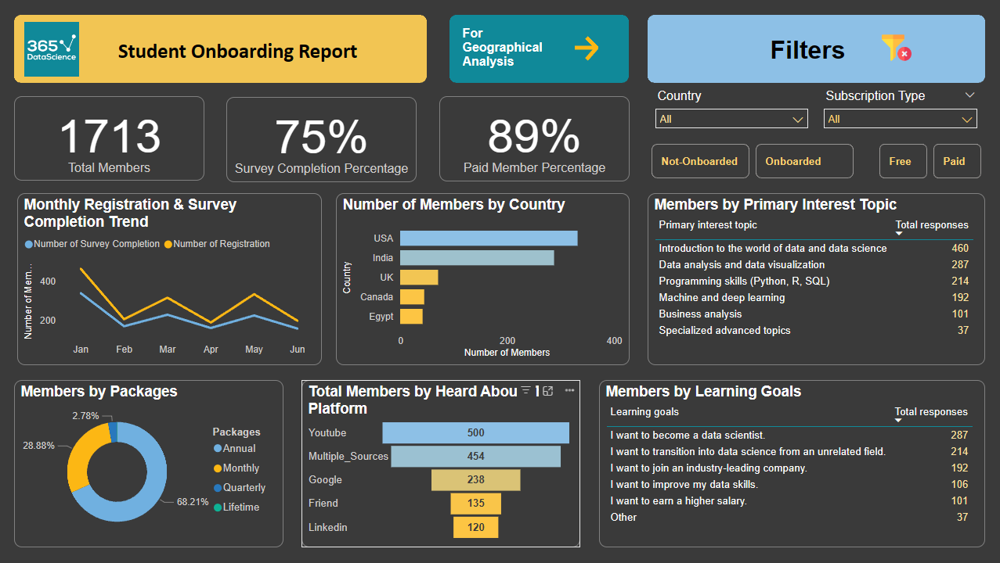
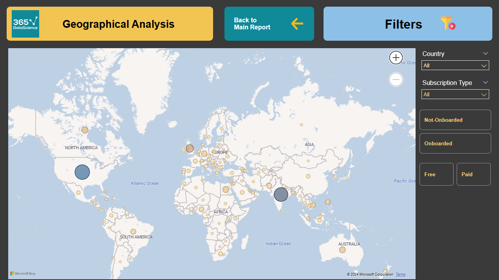

# 365datascience Onboarding Report

This project analyzes user data from the 365datascience website, focusing on membership trends, subscription types, and engagement insights. The workflow includes data cleaning in Power Query, visualization in Power BI, and cross-validation using SQL to ensure accuracy and consistency.

## Dashboard

## Analysis Overview

1. **Total Members and Paid Membership**: Counts all members and calculates the percentage of paid members.
2. **Survey Completion Rate**: Calculates the total number of surveys completed and the percentage of completed surveys.
3. **Monthly Trends**: Tracks monthly registration and survey completions to highlight user activity patterns.
4. **Country Distribution**: Lists the top 5 countries by member count.
5. **Subscription Type Analysis**: Shows the percentage of each subscription type among users.
6. **Sources and User Interests**:
   - Primary sources where users heard about the platform.
   - Main topics of interest and learning goals among members.

## Workflow

- **Data Cleaning**: Conducted in Power Query to ensure data consistency and handle missing or inconsistent values.
- **Visualization**: Built in Power BI to display trends, distributions, and insights in an interactive format.
- **Cross-Validation**: SQL queries are used to validate key metrics and ensure data accuracy across different stages of the analysis.

## Queries and Results

The SQL queries in this repository provide a breakdown of metrics related to registration, subscription, survey completion, and demographic distribution. They are organized for easy execution and retrieval of insights on user demographics and engagement patterns.

